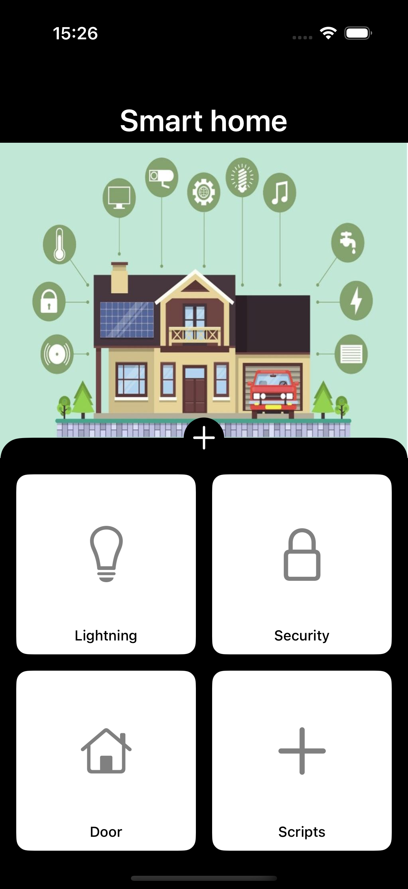
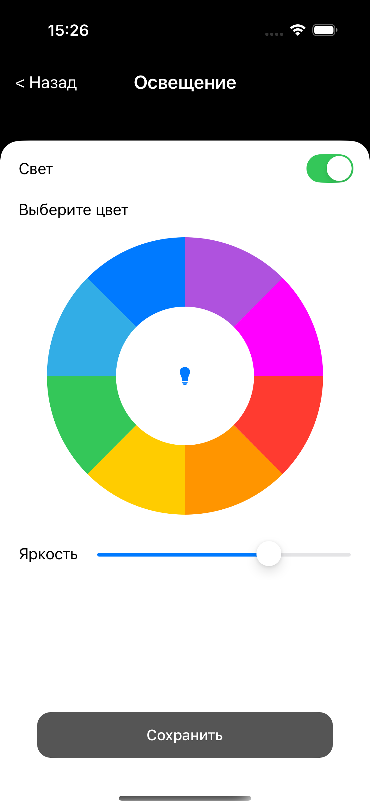
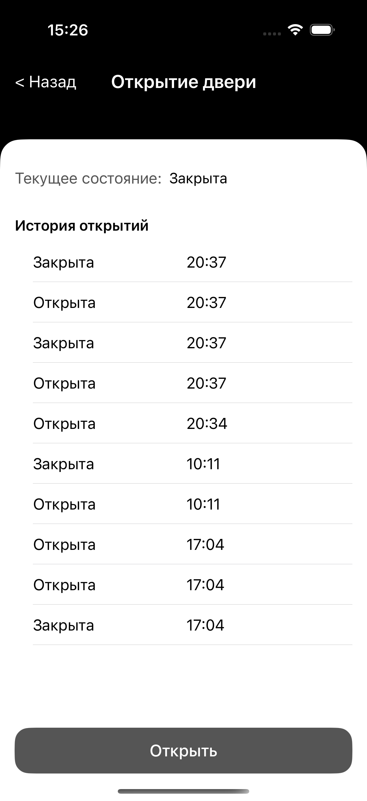
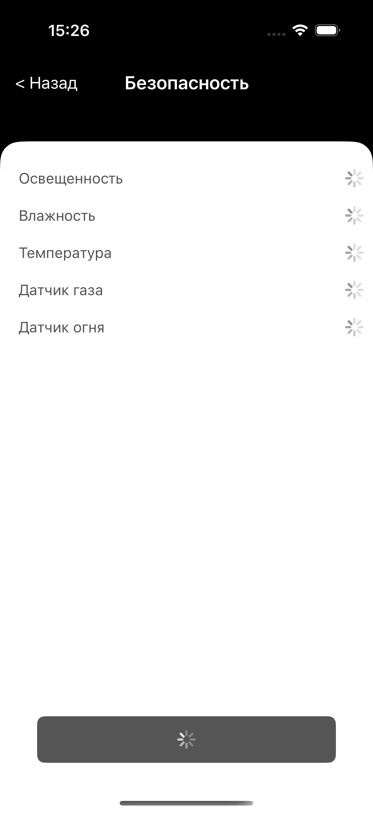
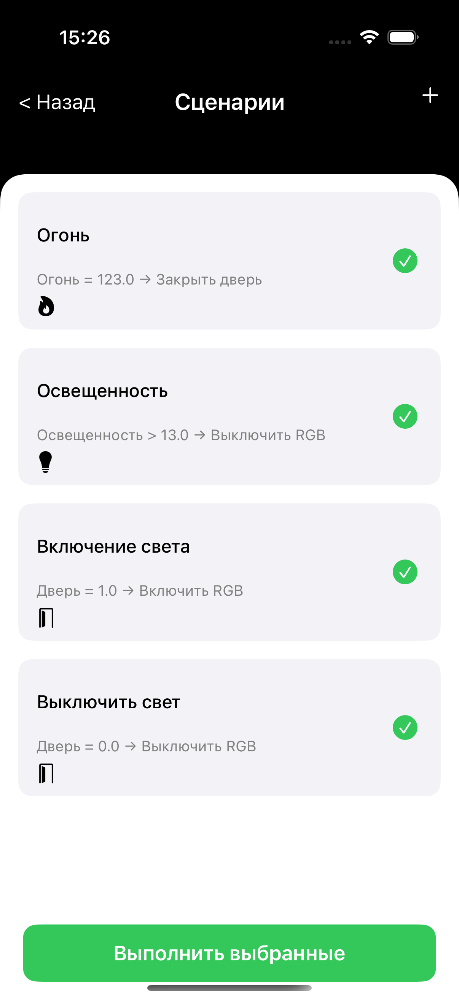
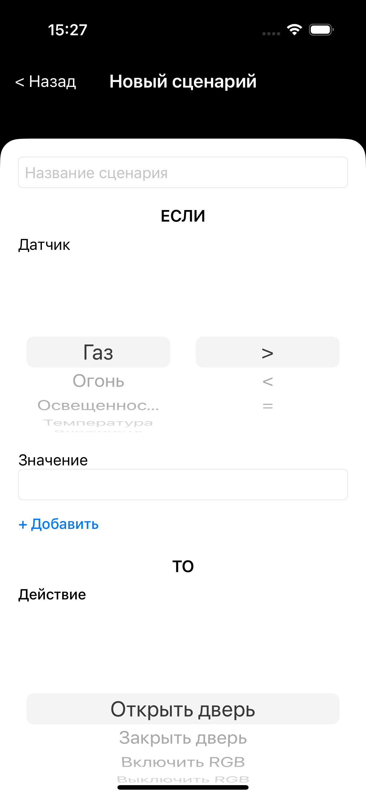

# Smart Home
### Исследование и разработка системы мобильного управления умным домом

В данной работе проведено исследование в области автоматизации жилищного пространства с использованием технологий умного дома. Основной целью работы стало проектирование и разработка мобильной системы управления умным домом, обеспечивающей удаленное взаимодействие пользователя с бытовыми устройствами.

Актуальность исследования обусловлена стремительным развитием технологий умного дома и растущей потребностью в их интеграции в повседневную жизнь пользователей. Современные тенденции в области автоматизации жилищного пространства требуют не только повышения функциональности систем, но и обеспечения их доступности, безопасности и управляемости.
Цель исследования заключается в изучении подходов к разработке системы мобильного управления «умным домом» при создании собственного продукта.
Для достижения этой цели поставлены следующие задачи:
● изучение современных технологий умного дома,
● анализ существующих систем мобильного управления для выявления их преимуществ и недостатков,
● разработка концепции новой системы,
● реализация прототипа,
● оценка его эффективности и перспектив дальнейшего развития

Для выбора оптимального контроллера, подходящего под требования системы умного дома, был проведен сравнительный анализ нескольких популярных решений, среди которых — Arduino Uno, Raspberry Pi, Particle Photon и Teensy 3.5. Основное внимание уделялось следующим характеристикам: тактовая частота процессора, объем оперативной памяти, энергоэффективность (в расчете на час работы на 1 Вт потребления) и количество доступных цифровых входов/выходов (GPIO), необходимых для подключения периферийных устройств. Каждый из этих параметров оказывает непосредственное влияние на производительность, устойчивость и масштабируемость системы. Представленная ниже диаграмма позволяет наглядно оценить сильные и слабые стороны рассматриваемых платформ в контексте поставленных задач.

Рассмотрены протоколы связи устройств, на которых базируются все IoT проекты и отмечены преимущества и недостатки каждого. Также рассмотрены протоколы и стандарты для совместимости устройств, ведь это критически важно для создания универсальной системы управления умным домом. Затем я проанализировал уже существующие системы и составил сравнительные характеристики каждой. Для такого анализа были выбраны ключевые аспекты, к которым можно отнести функционал, уровень совместимости с другими системами, возможности масштабирования и ограничения по безопасности. 
На следующем этапе была разработка концепта собственного мобильного приложения для управления умным домом. В результате была предложена система для управления всеми устройствами и автоматизации сценариев. Данный концепт дает возможность пользователям быстро и легко управлять всеми подключенными устройствами, входящими в состав умного дома, а также легко расширять функционал системы, добавляя новые устройства и датчики.
Во второй главе подробно описаны все этапы реализации этого концепта. Она включает в себя этап выбора технологий и архитектуры системы, построение и реализация всех узлов будущей системы, написание кодовой базы для корректной работы всех устройств, а также тестирование.
Во время разработки системы был встречен ряд сложностей, тесно связанных с добавлением разных датчиков в общую группу, однако все их удалось успешно преодолеть, благодаря грамотному анализу и улучшениям решений конкурентов. 
Во время проведения тестирования было заключено, что все задачи по разработке системы удалось успешно решить. Пользователи отметили комфортность использования, а также возможность масштабирования и расширения системы. По их мнению, это ключевые аспекты, определяющие выбор системы.
После этого был проведен анализ эффективности созданного проекта. Он проводился на основе различных критериев, которые включаются в себя скорость отклика системы, уровень удобства использования системы, и безопасности. Были рассмотрены перспективы будущего развития системы, особенно перспективным направлением была отмечена интеграция с искусственным интеллектом, ведь это поможет и упростит пользование системой. В заключении нужно отметить, что проведенное исследование продемонстрировало, что проблема действительно является актуальной и необходимой в современном мире, где каждая отдельная крупная компания стремится к внутренней закрытости и ограниченности, а каждый новый датчик стоит довольно внушительных денег и в некоторых случаях невозможности их официального приобретения.

## Скриншоты

<table>
  <tr>
    <th>Главная</th>
    <th>Освещение</th>
    <th>Дверь</th>
    <th>Безопасность</th>
    <th>Сценарии</th>
    <th>Добавление сценария</th>
  </tr>
  <tr>
    <td></td>
    <td></td>
    <td></td>
    <td></td>
    <td></td>
    <td></td>
  </tr>
</table>
